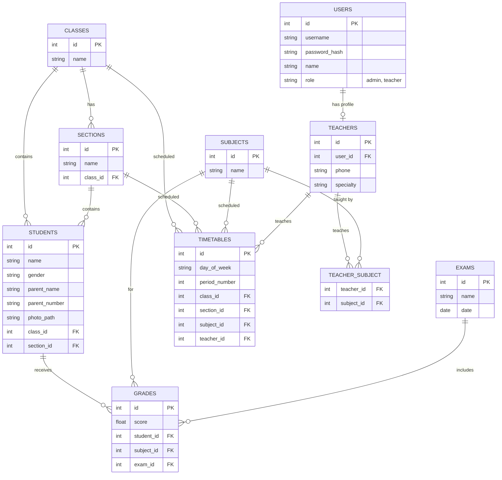

# تقرير مشروع نظام إدارة المدرسة الاحترافي

## 1. المقدمة (Introduction)
يعتبر قطاع التعليم من أهم القطاعات التي تتطلب تنظيماً عالياً ودقة في إدارة البيانات. تم تطوير **نظام الإدارة المدرسية الاحترافي** لتوفير منصة ويب متكاملة تسهّل على المدارس إدارة كافة شؤونها الأكاديمية والإدارية. تم بناء النظام باستخدام إطار عمل Flask (Python) وقاعدة بيانات علائقية، مع واجهات مستخدم عصرية (Bootstrap 5) وميزات متقدمة.

## 2. المشكلة (Problem Statement)
تعاني العديد من المدارس من:
- صعوبة في إدارة بيانات الطلاب والمعلمين بشكل يدوي ومشتت.
- غياب آلية ذكية لاكتشاف وتجنب تعارض الحصص للمعلمين في الجدول الدراسي.
- صعوبة في تتبع درجات الطلاب وإنشاء تقارير أكاديمية دورية بشكل سريع ومنظم.
- بطء في الوصول إلى الإحصائيات العامة للمدرسة.

## 3. أهداف النظام (System Objectives)
تم تصميم هذا النظام لتحقيق الأهداف التالية:
1. **إدارة المستخدمين والصلاحيات**: توفير نظام دخول آمن للإدارة والمعلمين.
2. **إدارة الطلاب والمعلمين**: القدرة الكاملة على إضافة وتعديل وحذف بيانات الطلاب والمعلمين بدقة.
3. **التنظيم الأكاديمي**: بناء هيكل مترابط للصفوف، الشعب، والمواد الدراسية.
4. **الجدول الدراسي الذكي**: ميزة فريدة لاكتشاف وتنبيه المستخدم عند وجود تعارض في حصص المعلم (Conflict Detection).
5. **إدارة الاختبارات والدرجات**: إدخال درجات الطلاب وتقييمها آلياً.
6. **التقارير والإحصائيات**: توفير لوحة تحكم سريعة (Dashboard) مع بحث فوري، وطباعة كشوفات الدرجات.

## 4. مخطط الكيانات والعلاقات (ERD)
فيما يلي الهيكل المصحح لقاعدة البيانات الذي يوضح الروابط (Many-to-Many و One-to-Many) بشكل دقيق:

## 5. التقنيات المستخدمة
- **الخلفية (Backend):** Python, Flask, SQLAlchemy.
- **قاعدة البيانات (Database):** MySQL (pymysql) بدلاً من SQLite كما تم التعديل مؤخراً.
- **الواجهة الأمامية (Frontend):** HTML5, CSS3, Bootstrap 5 RTL, JavaScript.
- **الهيكلة:** بنية Modular باستخدام Flask Blueprints لضمان نظافة الكود (Clean Architecture).

---
*تم إنشاء هذا التقرير كجزء من توثيق نهاية مرحلة التطوير للمشروع.*
